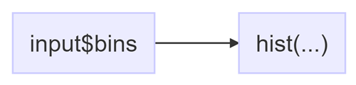
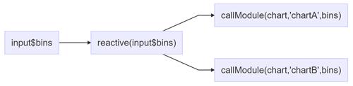
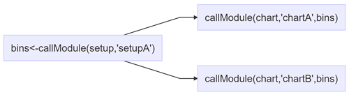

---
output:
  md_document:
    variant: markdown_github
---

<!-- README.md is generated from README.Rmd. Please edit that file -->

```{r, echo = FALSE}
knitr::opts_chunk$set(
  collapse = TRUE,
  comment = "#>",
  fig.path = "README/README-",
  screenshot.opts=list(delay = 5)
)
library(magrittr)
library(DiagrammeR)
library(DiagrammeRsvg)
```

# Input(s) passed to multiple modules
This series of examples illustrates the design pattern of passing one or more inputs through to another module.

## [01_original.R](01_original.R)
The standard shiny app example with some comments removed for brevity.
```{r echo=FALSE, eval=FALSE}
DiagrammeR("graph LR
           I[input$bins]-->CA[\"hist(...)\"]")
```


## [02_singlegloballevelinput.R](02_singlegloballevelinput.R)
Push an input parameter created at the app level to two instances of a chart module.

```{r echo=FALSE, eval=FALSE}
DiagrammeR("graph LR
           I[input$bins]-->R[\"bins<-reactive(input$bins)\"]
           R-->CA[\"callModule(chart,'chartA',bins)\"]
           R-->CB[\"callModule(chart,'chartB',bins)\"]
           ")
```


An in-depth explanation is available on my [blog post](http://itsalocke.com/shiny-module-design-pattern-pass-inputs-one-module-another/)

## [03_inputmodule.R](03_inputmodule.R)
Use a input parameter from one module in another module.

```{r echo=FALSE, eval=FALSE}
DiagrammeR("graph LR
           I[\"bins<-callModule(setup,'setupA')\"]-->CA[\"callModule(chart,'chartA',bins)\"]
           I-->CB[\"callModule(chart,'chartB',bins)\"]
           ")
```

